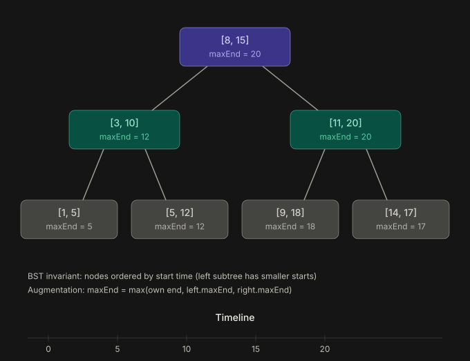

# Calendar API Design with an Augmented Interval Tree (Claude Opus 4.6)

*A conversation with Claude Opus 4.6: designing Add / Remove / GetOverlappingEvents for a calendar, using a balanced BST ordered by start time and augmented with maxEnd so overlap queries prune whole subtrees - O(log n) updates, O(log n + k) queries.*

<table style="margin: 32px 0 20px auto; max-width: 75%; border-collapse: separate; border: none;">
<tr><td style="background: #1e3f73; color: #ffffff; border: none; border-radius: 20px; padding: 12px 18px; line-height: 1.5;">
<strong style="font-size: 1.4em;">Q:</strong>&nbsp; Imagine you need to design a calendar api:
<ul style="margin: 8px 0; padding-left: 22px;">
<li>Speaks in terms of events (an event is a tuple <code>(datetime start, datetime end)</code></li>
<li><code>void Add(Event event)</code> - add an event to the calendar.</li>
<li><code>Event[] GetOverlappingEvents(Event event)</code> - return all events in the calendar that overlap with the given event</li>
<li><code>Remove(Event event)</code> - removes the given event from the calendar.</li>
</ul>
All the operations should be as fast as possible from the big O time perspective.
<br><br>
Do not write any code yet. First explain all the data structures and algorithms you're planning to use for the implementation. Be as detailed as reasonably needed. Use visuals where helpful.
</td></tr>
</table>

## Calendar API Design: Data Structures & Algorithms

### The Core Problem

We need a container of intervals that supports fast insert, delete, and **overlap queries**. Two events overlap when neither ends before the other starts:

```text
Overlap ⟺ A.start < B.end  AND  B.start < A.end
```

A naïve list gives O(n) for overlap queries. We can do much better.

### The Data Structure: Augmented Interval Tree

The ideal structure is an **Interval Tree** - a balanced binary search tree (e.g., red-black tree or AVL tree) with one extra piece of bookkeeping per node.

Each node stores three things:

1. **The event itself** (start, end)
2. **Left/right child pointers** (standard BST)
3. **`maxEnd`** - the maximum `end` value found anywhere in that node's subtree (including itself). This is the key augmentation.

Nodes are ordered by **start time** (the BST invariant). The `maxEnd` field is what makes overlap queries fast - it lets us skip entire subtrees that can't possibly contain overlapping events.

Let me visualize the structure so the `maxEnd` augmentation is clear.



Notice how `maxEnd` propagates upward: the root's `maxEnd = 20` tells us "somewhere in this entire tree, an event ends as late as time 20." Each subtree carries this same guarantee locally.

---

### How Each Operation Works

#### `Add(event)` - O(log n)

This is a standard balanced BST insertion keyed on `event.start`, plus a `maxEnd` fixup on the way back up:

1. Walk down the tree comparing `event.start` to find the correct leaf position (standard BST insert).
2. Insert the new node.
3. **Walk back up to the root**, updating every ancestor's `maxEnd` to be `max(self.end, left.maxEnd, right.maxEnd)`. This is O(1) per node on the path.
4. If using a self-balancing tree (red-black or AVL), perform any necessary rotations to maintain balance. After each rotation, recalculate `maxEnd` for the two rotated nodes - still O(1) per rotation.

Total: O(log n) for the walk + O(log n) worst case for rebalancing = **O(log n)**.

#### `Remove(event)` - O(log n)

Standard balanced BST deletion, again with a `maxEnd` fixup:

1. Find the node matching the event - O(log n). If duplicate start times are possible, you walk to the correct node by also comparing `end`.
2. Delete using standard BST deletion (swap with in-order successor if needed).
3. Walk back up from the deletion point to the root, recalculating `maxEnd` at each ancestor.
4. Rebalance if needed; fix `maxEnd` after each rotation.

Total: **O(log n)**.

#### `GetOverlappingEvents(event)` - O(log n + k)

This is where the `maxEnd` augmentation pays off. The algorithm recursively searches the tree, using `maxEnd` to prune entire subtrees that can't contain overlaps:

```text
function queryOverlap(node, queryStart, queryEnd, results):
    if node is null:
        return

    // Does THIS node's event overlap the query?
    if node.start < queryEnd AND queryStart < node.end:
        results.add(node.event)

    // Should we search the LEFT subtree?
    if node.left is not null AND node.left.maxEnd > queryStart:
        queryOverlap(node.left, queryStart, queryEnd, results)

    // Should we search the RIGHT subtree?
    // (BST property: all right children have start >= node.start)
    if node.right is not null AND node.start < queryEnd:
        queryOverlap(node.right, queryStart, queryEnd, results)
```

The key pruning insight is on the left-subtree check: if `left.maxEnd <= queryStart`, then *every* event in the left subtree ends before the query starts - no overlap possible, skip the entire subtree. This single comparison eliminates potentially half the tree in one step.

Let me illustrate this pruning with a concrete query.

![Overlap query pruning example: querying for events overlapping [6, 11]; the left-left subtree is pruned because its maxEnd of 5 is less than query start of 6](images/overlap_query_pruning_dark.svg)

For the query `[6, 11]`, two subtrees are pruned entirely: the `[1, 5]` subtree (its `maxEnd = 5 < 6`, so nothing there can overlap), and the `[14, 17]` subtree (its `start = 14 ≥ 11`, and by the BST property everything to its right starts even later, so nothing there can overlap either). Out of 7 nodes, we only visit 5, and we find 4 overlapping results.

The total cost is **O(log n + k)**, where k is the number of results. The `log n` part comes from the tree traversal with pruning; the `k` part is unavoidable since we have to actually report each overlapping event.

---

### Handling Duplicates and Ties

One detail worth calling out: if multiple events share the same start time, we need a consistent tiebreaker to maintain a strict BST ordering. The simplest approach is to break ties by `end` time. Alternatively, each node can hold a *list* of events sharing the same `(start, end)` pair, with the tree keyed on the pair. This doesn't change the asymptotic complexity.

---

### Complexity Summary

| Operation | Time | Why |
|---|---|---|
| `Add` | O(log n) | BST insert + maxEnd fixup along the root path |
| `Remove` | O(log n) | BST delete + maxEnd fixup along the root path |
| `GetOverlappingEvents` | O(log n + k) | Tree walk with subtree pruning; k = result count |

Space is **O(n)** - one node per event, each carrying a constant amount of extra data (`maxEnd`).

The self-balancing property (red-black or AVL) is what guarantees the tree height stays at O(log n), preventing degenerate cases where all events are inserted in sorted order (which would make a plain BST degrade to a linked list with O(n) operations).
