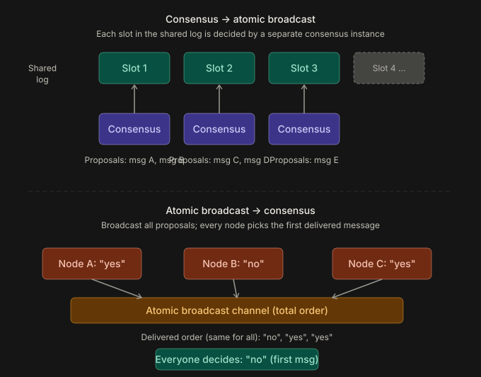

# Consensus ⇔ Atomic Broadcast (Claude Opus 4.6)

*A conversation with Claude Opus 4.6: what atomic (total order) broadcast is, who sends and who receives, and why it's equivalent to consensus - one agrees on a single value, the other on a sequence of them.*

<table style="margin: 32px 0 20px auto; max-width: 75%; border-collapse: separate; border: none;">
<tr><td style="background: #1e3f73; color: #ffffff; border: none; border-radius: 20px; padding: 12px 18px; line-height: 1.5;">
<strong style="font-size: 1.4em;">Q:</strong>&nbsp; Can you show/explain with a good human intuition that a consensus problem in a distributed system is equivalent to atomic broadcast (explain the essence of the atomic broadcast too)?
</td></tr>
</table>

Great question - this is one of the most elegant equivalences in distributed systems. Let me build up the intuition step by step.

### The Core Ideas

**Consensus** asks: "Given that several nodes each propose a value, can all nodes agree on *one* of them?" The key properties are that a decision is made exactly once, all nodes decide the same value, and that value was actually proposed by someone.

**Atomic Broadcast (Total Order Broadcast)** asks a seemingly different question: "Can all nodes receive all messages in *exactly the same order*?" Every node has its own stream of incoming messages, and atomic broadcast guarantees those streams are identical - same messages, same sequence. Think of it as a shared, append-only log that everyone sees the same way.

### Why They're the Same Thing - the Intuition

Here's the key mental model: **consensus is about agreeing on one thing; atomic broadcast is about agreeing on a *sequence* of things.** A sequence is just consensus applied repeatedly - one slot at a time.

**Direction 1: Consensus → Atomic Broadcast.** Imagine you have a magic consensus box. To build atomic broadcast, you simply number "slots" (1, 2, 3, …) and for each slot, you run consensus to decide which message goes there. Slot 1: everyone proposes a message, consensus picks one. Slot 2: same thing. You've now built a total order - everyone agrees message X is first, Y is second, etc. This is essentially how Paxos/Raft work: each log entry is a separate consensus instance.

**Direction 2: Atomic Broadcast → Consensus.** Now imagine you have a magic atomic broadcast channel. To solve consensus, each node simply broadcasts its proposed value. Since atomic broadcast guarantees everyone sees messages in the same order, everyone picks the *first* message they deliver - and since the order is identical for all nodes, they all pick the same one. Done.

Let me visualize both directions:

*Let me build a visual that captures both directions of this equivalence.*

### The Deep Intuition

The reason this equivalence holds is that both problems are fundamentally about the same thing: **getting all nodes to agree on an ordering of events**.

Consensus looks like it's about "one value," but the moment you need to do *anything* useful in a distributed system - process transactions, replicate state, coordinate actions - you need to agree on values *over and over*, which is a sequence. And agreeing on a sequence is exactly atomic broadcast.

Atomic broadcast looks like it's "just" about message ordering, but choosing which message comes first *is* a consensus decision. The total order doesn't emerge from physics (there's no global clock); it has to be *decided* - and that decision is consensus.

So they're two lenses on the same fundamental capability: **the ability of a group of unreliable machines to act as if they share a single, consistent timeline**. Consensus gives you one tick of that timeline. Atomic broadcast gives you the whole timeline. One is the brick, the other is the wall - and you can build either from the other.

This is why systems like Raft and Paxos look like consensus protocols but actually implement replicated logs (atomic broadcast) - each log entry is a consensus instance. And it's why ZooKeeper's atomic broadcast protocol (Zab) can be used to implement consensus as a special case.

<table style="margin: 32px 0 20px auto; max-width: 75%; border-collapse: separate; border: none;">
<tr><td style="background: #1e3f73; color: #ffffff; border: none; border-radius: 20px; padding: 12px 18px; line-height: 1.5;">
<strong style="font-size: 1.4em;">Q:</strong>&nbsp; You messed up in the two following areas:
 
1. Describing atomic broadcast you didn't say who gets to broadcast and who gets to receive, i.e. didn't define the roles and the goals in/of that communication
 
2. Above you said the following thing which is a nonsense (contains two conflicting statements): "Every node has its own stream of incoming messages, and atomic broadcast guarantees those streams are identical - same messages, same sequence. Think of it as a shared, append-only log that everyone sees the same way." - so it's either "its own stream of incoming messages" OR "think of it as a shared append-only log"??
</td></tr>
</table>

You're right on both counts. Let me fix them.

**On point 1 - roles in atomic broadcast:** Every node is both a sender and a receiver. Any node can broadcast a message at any time, and the protocol guarantees that every message broadcast by *any* node is eventually delivered to *all* nodes, and all nodes deliver them in the same total order. There's no distinguished "broadcaster" - it's symmetric. The goal is: if node A broadcasts message X and node B broadcasts message Y, then either every node delivers X before Y, or every node delivers Y before X. Nobody sees them in different orders.

**On point 2 - you're absolutely right, that was self-contradictory.** The reality is straightforward: there is no "its own stream" in any meaningful sense. The whole point of atomic broadcast is that every node ends up with the *same* sequence of messages. That *is* the shared append-only log. Each node maintains a local copy of this log, sure - but calling those "their own streams" suggests the streams could differ, which is exactly what atomic broadcast prevents. The correct framing is just: atomic broadcast gives you a single logical log that all nodes agree on, even though physically each node stores its own copy. The copies are guaranteed identical - that's the whole invariant.

So the clean definition is: atomic broadcast is a communication primitive where any node can submit a message, and the system ensures that all nodes deliver all submitted messages in one globally agreed-upon order - producing, in effect, a single shared append-only log.
