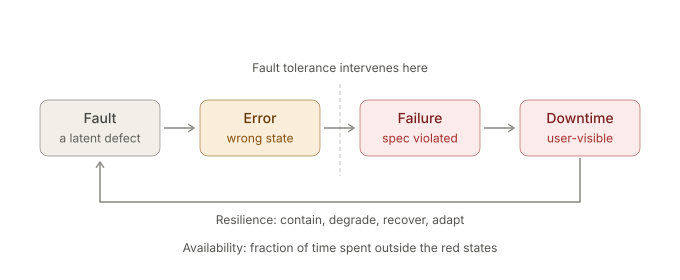
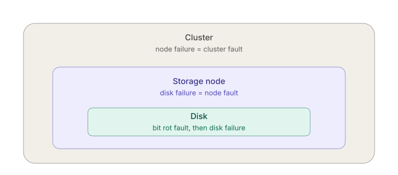

# Fault Tolerance vs. Resiliency vs. Availability (Claude Opus 4.8)

*A conversation with Claude Opus 4.8: why availability, fault tolerance and resiliency are a measure, a design property and a capability, how they connect through the fault → error → failure chain and MTBF/MTTR, and when to say "fault model" vs. "failure model".*

<table style="margin: 32px 0 20px auto; max-width: 75%; border-collapse: separate; border: none;">
<tr><td style="background: #1e3f73; color: #ffffff; border: none; border-radius: 20px; padding: 12px 18px; line-height: 1.5;">
<strong style="font-size: 1.4em;">Q:</strong>&nbsp; What is the difference between:
  
1. Fault tolerance
 
2. Resiliency
 
3. Availability
 
?
 
It feels like those terms are defined somewhat differently sometimes with quite a bit of overlap.. Also, those seem to be interconnected in many ways. Can you try and untangle it using most adopted industry-accepted definitions?
</td></tr>
</table>

Because they're often used loosely, the fastest way to untangle them is to notice that they aren't three competing terms for the same thing - they belong to three different categories. One is a measure, one is a design property, one is a system capability. Vendor marketing flattens all three into "our thing doesn't go down," which is where the mush comes from.

The most defensible anchor is the Avizienis–Laprie–Randell–Landwehr dependability taxonomy (IEEE TDSC, 2004), which is what most standards ultimately descend from. In it:

- Availability is an attribute of dependability (alongside reliability, safety, integrity, maintainability).
- Fault tolerance is one of four means of attaining dependability (alongside fault prevention, fault removal, fault forecasting).
- Resilience was added later by Laprie (2008) as "the persistence of dependability when facing changes" - i.e. dependability extended to disruptions you didn't enumerate up front.

### The fault → error → failure chain

Almost all of the confusion dissolves once you have this chain, because each term intervenes at a different point on it.

### The three definitions

**Availability - a measurable outcome.** The proportion of time a system delivers correct service, conventionally `A = MTBF / (MTBF + MTTR)`, reported in nines. It's a number you observe after the fact, or commit to in an SLA. It's not a technique, and nothing about the number tells you how it was achieved. ISO/IEC 25010 places availability as a sub-characteristic of Reliability, sitting right next to fault tolerance and recoverability as siblings.

**Fault tolerance - a design property.** The ability to continue delivering correct service in the presence of active faults, by detecting errors and recovering from them before they propagate to the service interface. Two things characterize it:

- **It works against an enumerated fault model.** You state up front what you tolerate: "any single node failure," "up to `f < n/3` Byzantine nodes," "one disk per RAID group." Outside that envelope, guarantees evaporate.
- **Its success condition is masking.** If the user could tell, it didn't tolerate the fault - it merely survived it.

**Resiliency - a system capability, broader and fuzzier.** NIST SP 800-160 Vol. 2's four verbs are the most useful operational definition: the ability to anticipate, withstand, recover from, and adapt to adverse conditions. Note what that adds: recovery and adaptation are explicitly in scope, and the disruptions need not be enumerated in advance. Load spikes, dependency outages, bad deploys, operator error, and correlated failures all count. AWS's Well-Architected framing is similar - recovery from disruption, dynamic resource acquisition, mitigation of misconfigurations and transient faults.

|                 | Category                | Question it answers                                    | Success looks like      |
| --------------- | ----------------------- | ------------------------------------------------------ | ----------------------- |
| Availability    | Metric / attribute      | How much correct service did we deliver?               | A high number           |
| Fault tolerance | Design property / means | Can we absorb this specific fault class invisibly?     | Nobody noticed          |
| Resiliency      | Capability              | Can we survive and recover from disruption generally?  | We bent, then came back |

### How they interconnect

The MTBF/MTTR identity makes the relationship almost mechanical:

- **Fault tolerance pushes MTBF up.** Faults occur but don't become failures, so the clock between system failures runs longer.
- **Resiliency pushes MTTR down and bounds blast radius.** Failures do occur, but they're contained, degraded gracefully, and recovered quickly.
- **Availability is what falls out of both.** It's the scoreboard, not a strategy.

So they're not overlapping definitions of one thing - they're two different levers and the dial they move. That's also why you can't "implement availability." You implement redundancy, replication, health checks, circuit breakers, bulkheads, backpressure, and rollbacks; availability is the consequence.

### Where the real overlap lives

Three genuine sources of ambiguity, worth naming:

**Fault tolerance is a subset of resiliency, not a synonym.** Every fault-tolerant mechanism is a resilience mechanism, but resilience also covers everything outside the fault model - graceful degradation, load shedding, incident response, and organizational learning. Some resilience-engineering literature (Hollnagel, Woods) goes further and treats the socio-technical system, including on-call humans, as the unit of analysis. That's the point where the term stops being purely an architecture word.

**Availability is not reliability, though the terms get swapped constantly.** Reliability is continuity of correct service - the probability of no failure over an interval. A system that blips for 200ms every five minutes can have excellent availability and terrible reliability. A system that fails once a decade but takes three weeks to repair has excellent reliability and dismal availability. Availability tolerates frequent short failures; reliability doesn't.

**"HA" and "FT" mean different things in vendor vocabulary.** VMware's usage is the canonical example: High Availability restarts your VM on another host after a host dies - you lose minutes. Fault Tolerance runs a lockstep shadow VM - RPO and RTO are both zero. This is a real distinction, and it matches the taxonomy: FT masks, HA recovers. When someone says "highly available," ask whether they mean masked or recovered quickly.

### A quick disambiguation test

When you hit one of these words in a doc or a design review:

- If it's a number with nines, or something you could compute from an uptime log → **availability**.
- If it names a specific fault it survives invisibly, with a stated redundancy level → **fault tolerance**.
- If it's about degrading, recovering, adapting, or handling something nobody enumerated → **resiliency**.
- If someone can't tell you which, they probably mean "we have replicas."

One more distinction that's easy to lose: fault tolerance is a binary property relative to a fault model ("we tolerate one AZ loss" is either true or false), while resiliency is a spectrum, and availability is a continuous measure. Arguing about whether a system "is resilient" is usually unproductive for that reason - the productive question is "resilient to what, degrading how, recovering in how long."

<table style="margin: 32px 0 20px auto; max-width: 75%; border-collapse: separate; border: none;">
<tr><td style="background: #1e3f73; color: #ffffff; border: none; border-radius: 20px; padding: 12px 18px; line-height: 1.5;">
<strong style="font-size: 1.4em;">Q:</strong>&nbsp; "fault model" or "failure model" - which one is the correct term?
</td></tr>
</table>

Both are correct terms in current use, and they aren't synonyms. The reason it feels unresolvable is that which one applies depends on where you draw the system boundary, not on which one is "right."

### The distinction

A **fault model** specifies the causes you assume can occur inside your system, and their bounds: type, persistence, arrival rate, correlation, how many at once. Stuck-at-0 on a circuit node. Single-bit flip in DRAM. One rack loses power.

A **failure model** specifies the observable behaviors a component can exhibit at its interface when it deviates from spec - deliberately saying nothing about the cause. Crash-stop. Crash-recovery. Omission. Timing. Byzantine. A protocol proof shouldn't care whether a node went Byzantine because of a cosmic ray, a bug, or an attacker; it only cares what the node can do to its peers.

> So: fault = cause, failure = observed deviation. That mapping is exactly the one from the fault → error → failure chain.

### Why they collapse into each other

Avizienis et al. make the recursion explicit: the failure of a component is a fault for the system that contains it. Same physical event, two names, depending on which side of the boundary you're standing on.

This is why "we tolerate up to `f < n/3` Byzantine nodes" is both. Byzantine is a failure model of a node (what a node can do at its interface) and simultaneously the fault model of the cluster (what the cluster assumes can go wrong inside it). Strictly, my phrasing earlier - calling Byzantine an enumerated fault model - was sloppy about which level I was speaking from.

### What each community actually says

- **Distributed systems / consensus:** overwhelmingly failure model. Crash-stop, omission, timing, Byzantine. The whole point is abstracting away cause, so "failure" is the honest word. Coulouris and Tanenbaum both use it as a section heading.
- **Hardware test & VLSI:** exclusively fault model. Stuck-at, bridging, transition. ATPG generates tests against a fault model; "failure model" would be odd there.
- **Fault injection and chaos engineering:** fault model - you're specifying causes to inject.
- **Dependability literature (Laprie lineage):** fault model / fault classes, with "failure" reserved strictly for interface deviation.
- **Real-time systems (Kopetz):** fault hypothesis - the assumptions about fault containment units, arrival rate, and what happens outside the envelope.

### Practical guidance

Use failure model when you're specifying what your components may do to you, especially in a distributed protocol. Use fault model when you're specifying what may go wrong inside, especially at hardware, injection, or safety-analysis level. If you say which level you mean, no one will object to either.

Three adjacent terms worth not conflating:

- **Failure mode ≠ failure model.** FMEA sense: one specific manner in which a component fails ("valve fails open"). It's an instance, not a specification of the space.
- **Fault hypothesis** - Kopetz's term, and arguably the clearest, because it names the thing as an assumption you might be wrong about.
- **Threat model** - the security analogue. Same structure, but the "faults" are adversary capabilities and the arrival process is intelligent rather than stochastic.

The one thing that is unambiguously an error is using either term without saying what's inside it. "We have a fault model" conveys nothing; "we tolerate one AZ loss, fail-stop, no correlated bit corruption, at most one at a time" is a fault model.
